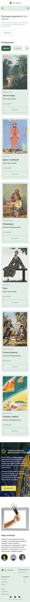

# House

<h1>Инсрументы реализации сайта:</h1>
<h2>Frontend(client):</h2>
<ul>
<li>TypeScript</li>
<li>React</li>
<li>Zustand</li>
<li>React query</li>
<li>Sass(Scss)</li>
<li>Axios</li>
<li>Vite</li>
</ul> 

<h2>Backend(server):</h2>
<ul>
<li>TypeScript</li>
<li>Node.js</li>
<li>Express</li>
<li>MySQL</li>
<li>TypeORM</li>
</ul> 

Desktop версия сайта:

    

Mobile версия сайта:

    

Разные типы репродукций:

<h1>Французская:</h1>
   

<h1>Немецкая:</h1>
   

<h1>Английская:</h1>
   
